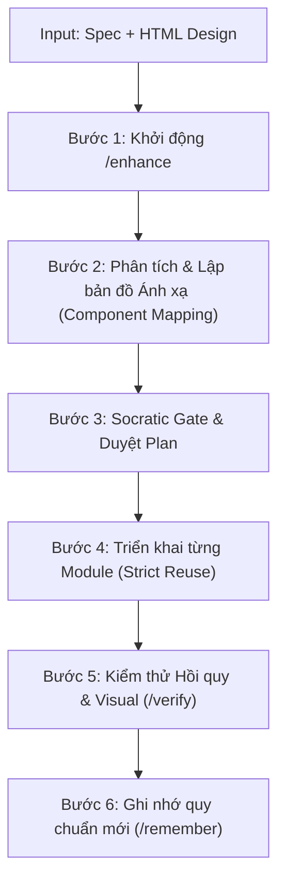

# Hướng Dẫn Sử Dụng AG Kit (User Workflow Guide - Tiếng Việt)

Tài liệu này hướng dẫn chi tiết cách vận hành và tương tác hiệu quả với **AG Kit (Antigravity Kit)** trong các tình huống thực tế: phát triển tính năng, sửa lỗi, khởi tạo ứng dụng, và nâng cấp UI/UX quy mô lớn.

[English Version](./USER_GUIDE.md)

---

## 📌 Bảng Tra Cứu Nhanh Slash Commands

| Tình huống / Yêu cầu | Lệnh Slash Command | Agent & Skills phụ trách |
| :--- | :--- | :--- |
| **Phát triển tính năng mới vào app có sẵn** | `/enhance [mô tả]` | `orchestrator` + `codebase reconnaissance` |
| **Gặp lỗi, crash, bug cần điều tra** | `/debug [mô tả/log lỗi]` | `debugger` + `systematic-debugging` |
| **Lập kế hoạch kiến trúc trước khi làm** | `/plan [mô tả task]` | `project-planner` + `plan-writing` |
| **Kiểm thử & xác thực code chạy thực tế** | `/verify` | `qa-engineer` + `verify-changes` |
| **Khởi tạo app mới từ đầu (scaffold)** | `/create [ý tưởng]` | `app-builder` + `project-planner` |
| **Phối hợp đa chuyên gia (FE, BE, Sec)** | `/orchestrate` | Multi-agent coordination |
| **Lưu quy ước / quyết định vào bộ nhớ** | `/remember [nội dung]` | `memory-system` |

---

## 🚀 1. Luồng Nâng Cấp UI/UX Lớn (Từ Spec & Design HTML có sẵn)

> **Bối cảnh**: Bạn có một dự án đang chạy ổn định. Yêu cầu đặt ra là làm mới giao diện/trải nghiệm một tính năng lớn, đầu vào gồm:
> 1. File tài liệu mô tả chi tiết (`spec.md` hoặc PRD).
> 2. Các file mockup/prototype giao diện dạng HTML (`index.html`, `style.css`).

### ⚠️ Rủi ro cần tránh:
AI thường có xu hướng **copy-paste nguyên khối HTML/CSS** vào dự án, làm vỡ kiến trúc component hiện tại, mất các custom hook, state management và logic validation đang hoạt động ổn định.

### 🔄 Quy trình 6 bước chuẩn với AG Kit:



#### Bước 1: Khởi động với lệnh `/enhance`
Mở phiên làm việc và mô tả rõ nguồn tài liệu:
```bash
/enhance Cập nhật UI/UX cho module [Tên_Module] dựa trên spec tại [docs/spec.md] và file design HTML tại [mockups/design.html].
```

#### Bước 2: Khảo sát Codebase & Lập Bản Đồ Ánh Xạ (Gap Analysis)
AI tuân thủ rule `Codebase & Architecture Respect`, không viết code ngay mà tiến hành:
1. **Khảo sát hệ thống hiện tại**:
   - Quét các component dùng chung: `Button`, `Modal`, `Input`, `Card`, `Table`...
   - Quét theme hiện hành: biến màu CSS, Tailwind tokens, typography.
   - Quét logic nghiệp vụ: custom hooks (`useAuth`, `useCart`), state store, API service, schema validation.
2. **Lập bảng Component Mapping**:
   - **Tái sử dụng (Reuse)**: Các phần tử trong HTML mới map trực tiếp vào component có sẵn.
   - **Mở rộng (Extend)**: Component cũ cần thêm `variant` hoặc `prop` mới nào để đáp ứng design.
   - **Tạo mới (New)**: Chỉ tạo component mới nếu hệ thống hoàn toàn chưa có.
   - **Bảo toàn Logic**: Giữ nguyên 100% hooks dữ liệu, không xóa bỏ logic chạy ngầm.

#### Bước 3: Socratic Gate & Phê duyệt Kế hoạch (`implementation_plan.md`)
AI xuất bản file kế hoạch và đặt các câu hỏi làm rõ:
- Các điểm vênh giữa HTML tĩnh và API thực tế.
- Các token màu sắc trong HTML cần map về biến CSS của theme dự án.
- Bạn chỉ cần xem lướt kế hoạch và bấm **Proceed** để AI bắt đầu thực thi.

#### Bước 4: Triển khai theo từng module nhỏ (Component-by-Component)
- Nâng cấp các atomic components trước.
- Lắp ráp layout mới bằng các component chuẩn của dự án (tuyệt đối không dùng raw HTML/inline CSS).
- Đấu nối lại custom hooks, state và form handlers vào giao diện mới.

#### Bước 5: Kiểm thử Hồi quy & Xác thực Trực quan (`/verify`)
- Chạy kiểm thử tự động: `npm test`, `tsc --noEmit`, `lint` để đảm bảo code cũ không bị gãy (No Regression).
- Khởi động dev server để so sánh trực quan màn hình mới với file HTML mẫu.

#### Bước 6: Ghi nhớ Quy ước Mới (`/remember`)
Nếu có quy ước mới phát sinh trong đợt cập nhật:
```bash
/remember Từ nay các form nhập liệu thuộc module [Tên_Module] sử dụng chuẩn spacing gap-6 và bo góc rounded-xl theo design mới.
```

---

## 🛠️ 2. Luồng Phát Triển Tính Năng Mới Thông Thường (Feature Workflow)

* **Lệnh**: `/enhance [mô tả tính năng]` hoặc `/plan [tính năng]`

1. **Khảo sát (Analysis)**: AI phân tích cấu trúc thư mục, tìm hiểu kiến trúc API và database hiện có.
2. **Lập kế hoạch (Planning)**: Tạo bảng phân rã công việc (Task breakdown), xác định các file bị ảnh hưởng.
3. **Phê duyệt (Approval)**: Bạn duyệt file `implementation_plan.md`.
4. **Viết mã (Implementation)**: AI code theo quy chuẩn Clean Code, viết unit test đi kèm.
5. **Xác thực (Verification)**: Chạy `/verify` để kiểm chứng kết quả thực thi.

---

## 🐛 3. Luồng Sửa Lỗi và Điều Tra Sự Cố (Debugging Workflow)

* **Lệnh**: `/debug [nội dung lỗi / stack trace / hành vi bất thường]`

Quy trình gỡ lỗi có kỷ luật **Systematic Debugging (4 giai đoạn)** — cấm đoán mò:

1. **Giai đoạn 1 - Thu thập triệu chứng (Symptom)**:
   - Định vị chính xác: File, dòng code, thông điệp lỗi và điều kiện tái hiện.
2. **Giai đoạn 2 - Đặt giả thuyết (Hypotheses)**:
   - Đưa ra 2–3 nguyên nhân khả dĩ nhất, xếp hạng theo độ ưu tiên.
3. **Giai đoạn 3 - Điều tra nguyên nhân gốc rễ (Root Cause)**:
   - Dùng log hoặc phân tích luồng dữ liệu (data flow) để loại trừ các giả thuyết sai cho đến khi tìm được bằng chứng xác thực nguyên nhân thật sự.
4. **Giai đoạn 4 - Vá lỗi & Phòng ngừa (Fix & Prevent)**:
   - Áp dụng bản vá tối giản nhất (minimal diff).
   - Thêm unit test hoặc assertion để lỗi tương tự không bao giờ lặp lại.

---

## 🏗️ 4. Luồng Khởi Tạo Ứng Dụng Mới Từ Đầu (New App Workflow)

* **Lệnh**: `/create [ý tưởng dự án]`

1. **Đối thoại tương tác (Interactive Dialogue)**:
   - AI hỏi rõ mục tiêu sản phẩm, đối tượng người dùng, nền tảng (Web / Mobile / Desktop).
2. **Chọn Tech Stack chuẩn**:
   - Web: Next.js (App Router), Tailwind CSS, TypeScript.
   - Mobile: React Native (New Architecture, Expo Router, Reanimated 3, FlashList).
3. **Bắt buộc thiết lập `DESIGN.md` trước khi code**:
   - Thiết lập bảng màu, typography, spacing token để chống giao diện lộn xộn (Anti-Slop UI).
4. **Scaffold & Live Preview**:
   - Tạo khung dự án và khởi chạy preview server để người dùng đánh giá.

---

## 💎 5. Mẹo Vàng Khi Tương Tác với AG Kit

1. **Tác vụ nhỏ (< 5 dòng code)**:
   - Không cần dùng slash command. Chỉ cần ra lệnh trực tiếp: *"Sửa giúp tôi kiểu dữ liệu trường `email` thành bắt buộc trong file `user.schema.ts`"*.
2. **Tác vụ lớn hoặc sửa nhiều file**:
   - Luôn sử dụng `/enhance` hoặc `/plan`. Dành 30 giây đọc lướt `implementation_plan.md` của AI trước khi bấm **Proceed**.
3. **Luôn tận dụng `/remember`**:
   - Khi bạn muốn AI luôn tuân thủ một quy ước nào đó trong các phiên làm việc sau (ví dụ: thư viện state, cách đặt tên biến, convention API), hãy dùng `/remember`.
4. **Tài liệu & Kế hoạch luôn lưu trong `docs-ref/*`**:
   - Mọi tài liệu, kế hoạch (`{task-slug}.md`), thông số thiết kế (`DESIGN.md`), tài liệu kiến trúc do AI tạo ra đều bắt buộc được lưu gọn gàng trong thư mục `docs-ref/*`, giữ thư mục gốc (root) luôn sạch sẽ.
