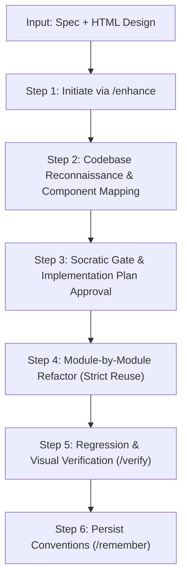

# AG Kit User Workflow Guide

This guide provides practical instructions on how to effectively operate and interact with **AG Kit (Antigravity Kit)** in real-world scenarios: developing features, debugging issues, creating new applications, and executing large-scale UI/UX overhauls.

[Bản Tiếng Việt (Vietnamese Version)](./USER_GUIDE-VI.md)

---

## 📌 Slash Command Quick Reference

| Scenario / Need | Slash Command | Active Agents & Skills |
| :--- | :--- | :--- |
| **Add/update features in an existing app** | `/enhance [description]` | `orchestrator` + `codebase reconnaissance` |
| **Investigate bugs, crashes, or errors** | `/debug [error log / description]` | `debugger` + `systematic-debugging` |
| **Architectural planning before coding** | `/plan [task description]` | `project-planner` + `plan-writing` |
| **Verify code changes by running tests** | `/verify` | `qa-engineer` + `verify-changes` |
| **Scaffold a new application from scratch** | `/create [idea/prompt]` | `app-builder` + `project-planner` |
| **Multi-perspective tasks (FE, BE, Sec)** | `/orchestrate` | Multi-agent coordination |
| **Persist decisions/conventions across sessions** | `/remember [topic]` | `memory-system` |

---

## 🚀 1. Major UI/UX Overhaul Workflow (From Spec & HTML Mockups)

> **Scenario**: You have an established, stable project. You need to overhaul the UI/UX of a major feature using two inputs:
> 1. A detailed specification document (`spec.md` or PRD).
> 2. New prototype/mockup design files in HTML format (`index.html`, `style.css`).

### ⚠️ Critical Risk to Avoid:
AI often defaults to blindly copy-pasting raw HTML/CSS into the codebase. This breaks existing component abstractions, duplicates styles, and destroys active business logic, custom hooks, and form validation state.

### 🔄 Standard 6-Step Workflow with AG Kit:



#### Step 1: Initiate with `/enhance`
Start your session by pointing the agent to the reference files:
```bash
/enhance Update the UI/UX for module [ModuleName] based on the specification at [docs/spec.md] and HTML mockup at [mockups/design.html].
```

#### Step 2: Codebase Reconnaissance & Gap Analysis
Governed by the `Codebase & Architecture Respect` rule, the AI is strictly forbidden from coding immediately. It will:
1. **Inspect the Active Codebase**:
   - Shared UI library: `Button`, `Modal`, `Input`, `Card`, `Table`...
   - Active design tokens: CSS variables, Tailwind theme, typography.
   - Business logic: custom hooks (`useAuth`, `useCart`), state stores, API services, validation schemas.
2. **Build a Component Mapping Table**:
   - **Reuse**: Map HTML mockup elements to existing project components.
   - **Extend**: Identify existing components requiring a new `variant` or `prop`.
   - **New**: Restrict new components to genuinely missing abstractions.
   - **Preserve Logic**: Keep 100% of existing hooks, validation, and data fetching intact.

#### Step 3: Socratic Gate & Plan Approval (`implementation_plan.md`)
The AI generates an implementation plan artifact and asks clarifying questions regarding:
- Discrepancies between static HTML mockups and real backend APIs.
- Color hex codes in HTML that should map to project CSS theme variables.
- You review the plan and click **Proceed** (or give feedback).

#### Step 4: Step-by-Step Implementation
- Update atomic components first.
- Reconstruct the layout using standardized project components (never raw HTML or inline CSS).
- Re-wire existing custom hooks, state stores, and form handlers to the updated interface.

#### Step 5: Regression & Visual Verification (`/verify`)
- Run automated verification: `npm test`, `tsc --noEmit`, and linter to guarantee no regression.
- Start the development server to visually confirm alignment with the HTML mockup.

#### Step 6: Persist New Conventions (`/remember`)
If new patterns emerged during the overhaul:
```bash
/remember From now on, form layouts in module [ModuleName] use gap-6 spacing and rounded-xl card borders.
```

---

## 🛠️ 2. New Feature Development Workflow

* **Command**: `/enhance [feature description]` or `/plan [feature description]`

1. **Analysis**: Inspect project structure, existing API patterns, and database schemas.
2. **Planning**: Create a task breakdown in `implementation_plan.md` identifying affected files.
3. **Approval**: User reviews and approves the plan.
4. **Implementation**: Code according to Clean Code standards, maintaining strict component reuse.
5. **Verification**: Run `/verify` to prove functionality through execution.

---

## 🐛 3. Systematic Debugging Workflow

* **Command**: `/debug [error message / stack trace / unexpected behavior]`

AG Kit enforces a disciplined **4-phase debugging methodology** (no guessing allowed):

1. **Phase 1 - Symptom Gathering**:
   - Pinpoint the exact file, line number, error payload, and reproduction steps.
2. **Phase 2 - Form Hypotheses**:
   - List 2–3 probable root causes, prioritized by likelihood.
3. **Phase 3 - Root Cause Investigation**:
   - Test hypotheses via targeted logging or data-flow analysis to isolate the definitive root cause.
4. **Phase 4 - Fix & Prevent**:
   - Apply a minimal diff fix.
   - Add unit tests or assertion guards to prevent recurrence.

---

## 🏗️ 4. New Application Scaffold Workflow

* **Command**: `/create [application idea]`

1. **Interactive Dialogue**:
   - AI clarifies core goals, target audience, and platforms (Web / Mobile / Desktop).
2. **Tech Stack Selection**:
   - Web: Next.js (App Router), Tailwind CSS, TypeScript.
   - Mobile: React Native (New Architecture, Expo Router, Reanimated 3, FlashList).
3. **Mandatory `DESIGN.md`**:
   - Establish color tokens, typography hierarchy, and spacing scales before writing any UI code (anti-slop).
4. **Scaffold & Live Preview**:
   - Scaffold project structure and launch the local preview server for evaluation.

---

## 💎 5. Golden Rules for Working with AG Kit

1. **Micro-tasks (< 5 lines)**:
   - Skip slash commands; state your request directly: *"Make the `email` field required in `user.schema.ts`"*.
2. **Complex tasks or multi-file changes**:
   - Always initiate with `/enhance` or `/plan`. Take 30 seconds to review `implementation_plan.md` before approving.
3. **Leverage `/remember` frequently**:
   - Whenever you want the AI to retain a convention for future sessions (e.g. state management preference, naming style, API rules), execute `/remember`.
