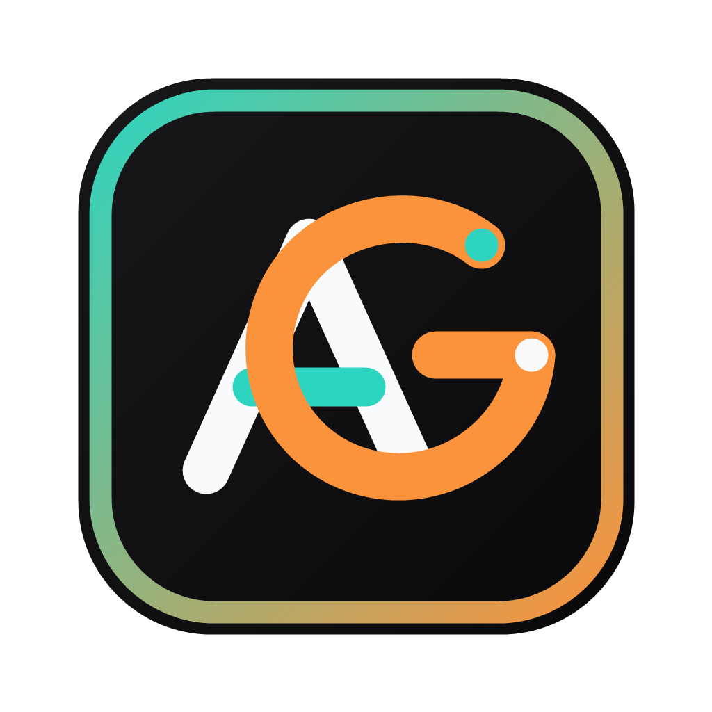

<p align="center">
  
</p>

<h1 align="center">AG Kit - Web Application</h1>

<p align="center">
    Next.js documentation and dashboard portal for AG Kit — AI Agent templates with Skills, Agents, and Workflows.
</p>

---

## ⚡ Quick Start (Local Development)

The `web/` directory contains the official online documentation site and interactive dashboard portal built using Next.js 16 and React 19.

1. **Install dependencies**:
   ```bash
   npm install
   ```

2. **Run local development server**:
   ```bash
   npm run dev
   ```

3. **Open browser**:
   Navigate to [http://localhost:3000](http://localhost:3000) to view the documentation portal locally.

---

## 🏗️ Architecture & Stack

*   **Framework:** [Next.js 16 (App Router)](https://nextjs.org/)
*   **Library:** [React 19](https://react.dev/)
*   **Styling:** [Tailwind CSS v4](https://tailwindcss.com/)
*   **MDX:** [@next/mdx](https://github.com/vercel/next.js/tree/canary/packages/next-mdx) for seamless markdown integration
*   **Components:** Built with [@base-ui/react](https://base-ui.com/) and Lucide React icons

---

## 📦 What gets installed by the CLI

When downstream developers run `npx @camilyos/ag-kit init`, they install a `.agents/` folder at their project root:

| Directory | Count | Description |
| :--- | :--- | :--- |
| **`agent/`** | 20 | Specialist AI agent configurations (Frontend, Backend, Security, PM, QA, etc.) |
| **`skills/`** | 45 | Domain-specific context modules with conditional loading rules |
| **`workflows/`** | 13 | Pre-configured interactive slash commands |

---

## 📚 Online Documentation

*   **[Official Documentation Portal](https://ag-kit.unikorn.vn/docs)**
*   **[GitHub Repository](https://github.com/dev-richardnguyen/ag-kit)**

---

## 📄 License

Released under the [MIT License](LICENSE) © [Richard Nguyen](https://github.com/dev-richardnguyen).
